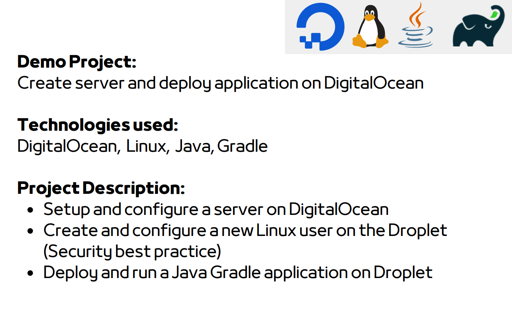

---

### Summary of Steps

1. **Pre-Requisite: Create DigitalOcean Account**
   - Sign up for a DigitalOcean account, leveraging any available new signup credits or free tier offerings.

2. **Configure SSH Keys**
   - Generate an SSH key pair to enable secure communication between the local machine and the Droplet:
     ```bash
     cat ~/.ssh/id_rsa.pub
     ```

3. **Create a Droplet**
   - Use the DigitalOcean dashboard to create a new Droplet, choosing the Linux Ubuntu distribution.
   - Associate the generated SSH key with the Droplet during the creation process.

4. **Configure Firewall**
   - Open SSH port 22 on the server using firewall configuration to allow secure access.
   - **note: use private ip address to allow only local machine can access to the server.
  
5. **SSH into the Server**
   - Connect to the Droplet via SSH using its public IP address:
     ```bash
     ssh root@<ip_address>
     ```

6. **Install Java**
   - Install the Java runtime environment on the Droplet to facilitate running Java applications:
     ```bash
     apt install openjdk-8-jre-headless
     ```

7. **Deploy and Run Java Gradle Application**
   - Copy the Java Gradle application JAR file from the local machine to the Droplet:
     ```bash
     scp build/libs/java-react-example.jar admin@<ip_address>:/home/admin
     ```
   - Execute the Java application on the Droplet:
     ```bash
     java -jar /home/admin/java-react-example.jar
     ```

 ***Security Best Practices**
   - Create a new "admin" user on the remote server.
   - For each application (e.g., Nexus, Jenkins, my-app), create dedicated users using the "admin" user.
   - Assign minimal permissions necessary for each application to run.
   - Avoid working with the root user for day-to-day operations.

